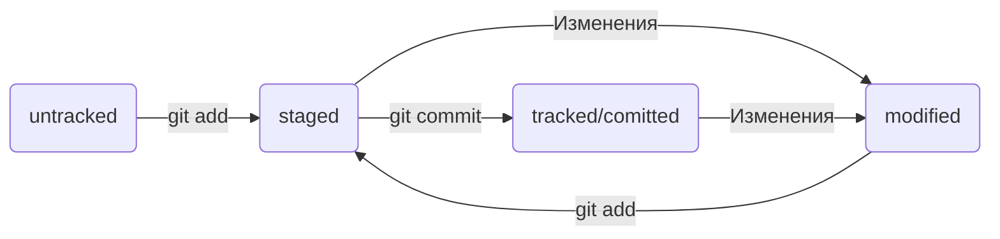

# Конспект Git

## Введение

Система контроля версий (англ. Version Control System, или коротко VCS).
Для обозначения систем контроля версий используют не только аббревиатуру VCS, но и SCM (от англ. Source Control Management — «система управления исходным кодом»).

Система контроля версий — общее название ряда продуктов, таких как Git, Mercurial, Subversion и других.

## Расшифровка Git

Например, Global Information Tracker (англ. «глобальный информационный трекер») — когда у вас всё хорошо и Git работает отлично. А если что-то идёт не так, Git превращается в Goddamn Idiotic Truckload of sh*t (англ. «чёртов идиотский грузовик c ...» — тут вы наверняка справитесь с переводом и без нас).

## Основные команды

### Сделать папку репозиторием — ```git init```
Чтобы Git начал отслеживать изменения в проекте, папку с файлами этого проекта нужно сделать Git-репозиторием (от англ. repository — «хранилище»). Для этого следует переместиться в неё и ввести команду git init (от англ. initialize — «инициализировать»).

#### Изменить название основной ветки

```git branch -M main```

Изменить название основной ветки по умолчанию:

```git config --global init.defaultBranch <name>```

### «Разгитить» папку, если что-то пошло не так, — ```rm -rf .git```

Разберём подробнее, что такое **-rf**:
- ключ **-r** (от англ. recursive — «рекурсивно») позволяет удалять папки вместе с их содержимым;
- ключ **-f** (от англ. force — «заставить»).

### Проверить состояние репозитория — ```git status```

(от англ. status — «статус», «состояние»)

### Подготовить файлы к сохранению — ```git add```

Добавить все файлы в репозитории ```git add --all```
(от англ. add — «добавить» + от англ. all — «всё»)

Добавить всю текущую директорию ```git add .```

### Выполнить коммит — ```git commit```

(от англ. commit — «совершать», «фиксировать»)

Сделать коммит можно командой ```git commit``` c ключом **-m** (от англ. message — «сообщение»), который присваивает коммиту сообщение.

Команда ```git commit``` выведет информацию о коммите.

```[master (root-commit) baa3b6e]``` значит:

* коммит был в ветке *master*;

* **root-commit** — это самый первый, или «корневой» (англ. root), коммит в ветке, у следующих коммитов такой надписи не будет;

* **baa3b6e** — сокращённый идентификатор коммита (подробнее об этом мы ещё расскажем).

```2 files changed, 1 insertion(+)``` значит:

* изменились два файла;

* одна строка была добавлена.

Строки вида ```create mode 100644 readme.txt``` — это более подробная информация о новых (добавленных в Git) файлах.

* **create** (англ. «создать») говорит, что файл был создан. Если бы файл был удалён, на этом месте было бы слово *delete* (англ. «удалить»).

* **mode 100644** сообщает, что это обычный файл. Также возможны варианты **100755** для исполняемых файлов и **120000** для файлов-ссылок в Linux.

### Просмотреть историю коммитов — ```git log```

(от англ. log — «журнал [записей]»)

### Получить сокращённый лог — ```git log --oneline```

Флаг **--oneline** (англ. «одной строкой»). В терминале появятся только первые несколько символов хеша каждого коммита и их комментарии.

Сокращённый хеш (то есть первые несколько символов полного) можно использовать точно так же, как и полный. Команда ```git log --oneline``` автоматически подбирает такую длину сокращённых хешей, чтобы они были уникальными в пределах репозитория и Git всегда мог понять, о каком коммите идёт речь.

### Привязать удалённый репозиторий к локальному — ```git remote add```

(от англ. remote — «удалённый» и add — «добавить»)

Команде необходимо передать два параметра: имя удалённого репозитория и его URL. В качестве имени используйте слово **origin**. А URL вы скопировали со страницы удалённого репозитория.

**origin** (англ. «источник») — стандартный псевдоним, с помощью которого можно обращаться к главному удалённому репозиторию (обычно такой репозиторий один).

### Убедиться, что репозитории связаны, — ```git remote -v```

Флаг **-v** — короткая форма флага **--verbose** (англ. «подробный»).

### Отправить изменения на удалённый репозиторий — ```git push```

(от англ. push — «толкать»)

В первый раз эту команду нужно вызвать с флагом **-u** и параметрами **origin** (имя удалённого репозитория) и **main** или **master** (название текущей ветки). Флаг **-u** свяжет локальную ветку с одноимённой удалённой. Как вы связывали локальный и удалённый репозитории в предыдущем уроке, так же и здесь нужно дополнительно связать ветки.

## Файл README.md

Описание принято указывать в файле README.md (от англ. read — «прочитай» и me — «меня»).

Как правило, в README.md проекта можно найти следующую информацию:

* Название проекта и его краткое описание: кем создан, для чего, какие решает задачи и какие закрывает проблемы.

* Технологии, которые применяются в проекте. В чём его отличие от аналогичных.

* Документация проекта — подробная инструкция о том, что представляет собой проект.

* Планы проекта, если они есть.

### Как создать и оформить README.md

README.md — текстовый файл.

Преимущество README.md в том, что можно добавлять разметку **markdown**.

Маркда́ун — это специальный язык разметки.

### Заголовки, абзацы и перенос

* **Заголовки** разных уровней создают решётками.
```
# H1 — заголовок первого уровня, самый большой
## H2 — заголовок второго уровня, поменьше
### H3
#### H4
##### H5
###### H6 — заголовок шестого уровня, самый маленький 
```

* Можно добавить **черту под заголовком или абзацем**.

```
#### Заголовок 4

Текст над чертой

---

Текст под чертой 
```

* Чтобы сделать **разрыв строки**, нужно поставить два пробела (в примере ниже они обозначены точками ```⋅⋅```) или сочетание символов ```<br>```.

```
Текст до переноса⋅⋅  
Текст после переноса <br>
Текст после второго переноса 
```

* Чтобы начать **новый параграф**, в конце предыдущей строки должно стоять два символа переноса.

```
line

another line  
```

Если сделать один перенос строки, как в примере ниже, и не поставить два пробела, текст сольётся в одну строку.

```
line 
another line 
```

### Выделение текста

* Чтобы выделить текст *курсивом* (```*текст*```), его заключают в звёздочки (астериски) или нижние подчёркивания.

```
Курсив — это *звёздочки* или _подчёркивания_. 
```

* Чтобы выделить текст **полужирным шрифтом** (```**текст**```), его окружают двойными звёздочками или двойными нижними подчёркиваниями.

```
Полужирный шрифт — двойные **звёздочки** или двойные __подчёркивания__.
Можно совместить выделение **звёздочки и _подчёркивания_**. 
```

* Чтобы ~~зачеркнуть текст~~ (```~~текст~~```), его окружают двойными волнистыми линиями — тильдами.

```
~~Зачёркнутый текст.~~ 
```

### Списки

* Для оформления **нумерованного списка** достаточно поставить в начало строки цифры с точкой.

```
1. Первый пункт нумерованного списка.
2. Второй пункт. 
```

* **Ненумерованный список** создаётся звёздочкой с пробелом в начале строки либо дефисом с пробелом.

```
* первый пункт ненумерованного списка;
* второй пункт ненумерованного списка

- первый пункт ненумерованного списка;
- второй пункт ненумерованного списка 
```

### Ссылки

* Чтобы сделать ссылкой часть текста, его заключают в квадратные скобки, а затем указывают нужный адрес в круглых скобках.

```
[Яндекс](https://www.yandex.ru) 
```

* Также можно добавить ссылке **тайтл** (от англ title — «название», «заголовок»). Тайтл — это всплывающая подсказка, которая появляется при наведении мыши на ссылку. Тайтл нужно заключить в кавычки и указать внутри скобок после адреса.

```
[Яндекс](https://www.yandex.ru "Я Yandex!") 
```

### Код

Чтобы оформить текст как код, нужно окружить его тройками косых кавычек — грависов. После первой тройки грависов указывают язык программирования, на котором написан код. В маркдауне есть поддержка синтаксиса почти всех популярных языков и инструментов.

```bash
ls - la
```
```html
<h1>А я просто текст</h1>
``` 

Обратите внимание: вторая тройка тройных кавычек стоит на отдельной строке.

## Хеш — идентификатор коммита

В процессе работы с Git вам будет часто встречаться понятие «хеш коммита».

### Что такое хеш. Хеширование коммитов

**Хеширование** (от англ. hash, «рубить», «крошить», «мешанина») — это способ преобразовать набор данных и получить их «отпечаток» (англ. fingerprint).

Информация о коммите — это набор данных: когда был сделан коммит, содержимое файлов в репозитории на момент коммита и ссылка на предыдущий, или **родительский** (англ. parent), коммит.

Git хеширует (преобразует) информацию о коммите с помощью алгоритма **SHA-1** (от англ. **S**ecure **H**ash **A**lgorithm — «безопасный алгоритм хеширования») и получает для каждого коммита свой уникальный **хеш** — результат хеширования.

Обычно хеш — это короткая (40 символов в случае SHA-1) строка, которая состоит из цифр 0—9 и латинских букв A—F (неважно, заглавных или строчных). Она обладает следующими важными свойствами:

* если хеш получить дважды для одного и того же набора входных данных, то результат будет гарантированно одинаковый;
* если хоть что-то в исходных данных поменяется (хотя бы один символ), то хеш тоже изменится (причём сильно).

### Хеш — основной идентификатор коммита

Git хранит таблицу соответствий ```хеш → информация о коммите```. Если вы знаете хеш, вы можете узнать всё остальное: автора и дату коммита и содержимое закоммиченных файлов. Можно сказать, что хеш — основной идентификатор коммита.

Хеши можно передавать в качестве параметра разным Git-командам, чтобы указать, с каким коммитом нужно произвести то или иное действие.

Все хеши и таблицу ```хеш → информация о коммите``` Git сохраняет в служебные файлы. Они находятся в скрытой папке .git в репозитории проекта.

## HEAD — всему голова

При вызове команды ```git log``` вы также могли заметить надпись ```(HEAD -> master)``` после хеша одного из коммитов.

### Файл HEAD

Файл **HEAD** (англ. «голова», «головной») — один из служебных файлов папки **.git**. Он указывает на коммит, который сделан последним (то есть на самый новый).

Внутри **HEAD** — ссылка на служебный файл: ```refs/heads/master``` (или ```refs/heads/main``` в зависимости от названия ветки). Если заглянуть в этот файл, можно увидеть хеш последнего коммита.

Когда вы делаете коммит, Git обновляет ```refs/heads/master``` — записывает в него хеш последнего коммита. Получается, что **HEAD** тоже обновляется, так как ссылается на ```refs/heads/master```.

Если нужно передать последний коммит, то вместо его хеша можно просто написать слово **HEAD** — Git поймёт, что вы имели в виду последний коммит.

## Статусы файлов в Git

До появления Git системы контроля версий выделяли только два статуса у файлов: «уже закоммичен» и «ещё не закоммичен».

Такое поведение интуитивно более понятно. Зато Git даёт больше контроля за состоянием файлов.

### Статусы untracked/tracked, staged и modified

Одна из ключевых задач Git — отслеживать изменения файлов в репозитории. Для этого каждый файл помечается каким-либо статусом.

* **untracked** (англ. «неотслеживаемый»)

Новые файлы в Git-репозитории помечаются как **untracked**, то есть неотслеживаемые. Git «видит», что такой файл существует, но не следит за изменениями в нём. У untracked-файла нет предыдущих версий, зафиксированных в коммитах или через команду git add.

* **staged** (англ. «подготовленный»)

После выполнения команды ```git add``` файл попадает в **staging area** (от англ. stage — «сцена», «этап [процесса]» и area — «область»), то есть в список файлов, которые войдут в коммит. В этот момент файл находится в состоянии **staged**.

#### Staging area, index и cache

**Staging area** также называют **index** (англ. «каталог») или **cache** (англ. «кеш»), а состояние файла **staged** иногда называют **indexed** или **cached**.

* **tracked** (англ. «отслеживаемый»)

Состояние **tracked** — это противоположность **untracked**. Оно довольно широкое по смыслу: в него попадают файлы, которые уже были зафиксированы с помощью ```git commit```, а также файлы, которые были добавлены в **staging area** командой ```git add```. То есть все файлы, в которых Git так или иначе отслеживает изменения.

* **modified** (англ. «изменённый»)

Состояние **modified** означает, что Git сравнил содержимое файла с последней сохранённой версией и нашёл отличия. Например, файл был закоммичен и после этого изменён.

Для файлов в состояниях **staged** и **modified** обычно не указывают, что они также **tracked**, потому что это состояние подразумевается.

### Про staged и modified

Команда ```git add``` добавляет в **staging area** только текущее содержимое файла. Если вы, например, сделаете ```git add file.txt```, а затем измените **file.txt**, то новое содержимое файла не будет находиться в **staging**.

Git сообщит об этом с помощью статуса **modified**: файл изменён относительно той версии, которая уже в **staging**. Чтобы добавить в **staging** последнюю версию, нужно выполнить ```git add file.txt``` ещё раз.

### Типичный жизненный цикл файла в Git



1. Файл только что создали. Git про него ещё ничего не знает. Состояние: **untracked**.
2. Файл добавили в **staging area** с помощью ```git add```. Состояние: **staged** (+ **tracked**).
* Возможно, изменили файл ещё раз. Состояния: **staged**, **modified** (+ **tracked**).

Обратите внимание: **staged** и **modified** у одного файла, но у разных его версий.

* Ещё раз выполнили ```git add```. Состояние: **staged** (+ **tracked**).
3. Сделали коммит с помощью ```git commit```. Состояние: **tracked**.
4. Изменили файл. Состояние: **modified** (+ **tracked**).
5. Снова добавили в **staging area** с помощью ```git add```. Состояния: **staged** (+ **tracked**).
6. Сделали коммит. Состояния: **tracked**.
7. Повторили пункты 4−7 много-много раз.

## Оформление сообщений к коммитам

Общие рекомендации по тому, как правильно составить сообщение. Оно должно быть:

* относительно коротким, чтобы его было легко прочитать;
* информативным.

### Стили оформления

#### Корпоративный

Во многих компаниях применяется **Jira** — система для организации проектов и задач. У каждой задачи в **Jira** есть идентификатор из нескольких заглавных латинских букв и номера. Например, LGS-239 значит, что это 239239-я задача в проекте LGS (сокращение от англ. logistics — «логистика»).
В корпоративном стиле в начале сообщения обычно указывают Jira-ID, а после — текст сообщения.

```
$ git commit -m "LGS-239: Дополнить список пасхалок новыми числами" 
```

#### Conventional Commits

Стандарт **Conventional Commits** (англ. «соглашение о коммитах») отличается качественной документацией и подробной проработкой. Он подходит для репозиториев с исходным кодом программ.

**Conventional Commits** предлагает такой формат коммита: ```<type>: <сообщение>```. Первая часть **type** — это тип изменений. Таких типов достаточно много. Вот два примера:

* **feat** (англ. «навык») — для новой функциональности;
* **fix** (от англ. «исправить», «устранить») — для исправленных ошибок.

Более подробный список на [сайте](https://www.conventionalcommits.org/ru/v1.0.0-beta.4/#%D1%81%D0%BF%D0%B5%D1%86%D0%B8%D1%84%D0%B8%D0%BA%D0%B0%D1%86%D0%B8%D1%8F)

#### GitHub-стиль

GitHub можно использовать не только для хранения файлов проекта, но и для ведения **списка задач** (англ. issue) этого проекта. Если коммит «закрывает» или «решает» какую-то задачу, то в его сообщении удобно указывать ссылку на неё. Для этого в любом месте сообщения нужно указать ```#<номер задачи>```.

```
$ git commit -m "Исправить #334, добавить график температуры" 
```

В таком случае GitHub свяжет коммит и задачу.

### Инфинитив и императив

Для сообщений на русском языке часто рекомендуют использовать инфинитивы. Например: Добавить тесты для PipkaService, Исправить ошибку #123 и так далее.

Для сообщений на английском рекомендуется использовать повелительное наклонение (англ. imperative). Например: Use library mega_lib_300, Fix exit button и так далее.

## Mermaid-схема

* Блок кода в маркдауне с типом **mermaid**

Перед блоком и после него нужны пустые строки, иначе GitHub может не понять, что это блок кода.

* Два символа ```%%``` обозначают в **mermaid** строку-комментарий.

* Чтобы сделать схему, нужно указать формат: **graph LR**. **Graph** — это простейший тип схем.

* Чтобы добавить элементы и связи (стрелки), используют строки вида **A --> B**. Такая строка создаст квадратные блоки А и B и соединит их стрелкой.

* Дополнительно можно указывать текст на стрелке. Например, так: **A -- "text" --> B**.

### Исправление коммита

Можно внести правки в уже сделанный коммит с помощью опции **--amend** (от англ. amend — «исправить», «дополнить») у команды **commit**: ```git commit --amend```.

Важно: опция **--amend** работает только с последним коммитом (HEAD). Для исправления более ранних коммитов есть другие команды.

#### Дополнить коммит новыми файлами — git commit --amend --no-edit

#### Изменить сообщение коммита — git commit --amend -m "Новое сообщение"

#### Выполнить unstage изменений — git restore --staged <file>

(от англ. restore — «восстановить»)

«Сбросить» все файлы из **staged** обратно в **untracked/modified**, можно воспользоваться командой ```git restore --staged .```

Раньше для этой операции использовали команду ```git reset HEAD```

#### «Откатить» коммит — git reset --hard <commit hash>

Будьте осторожны с командой ```git reset --hard```! При удалении коммитов можно потерять что-то нужное.

#### «Откатить» изменения, которые не попали ни в staging, ни в коммит, — git restore <file>

### Просматриваем изменения в файлах - git diff

(от англ. difference — «отличие», «разница»)

#### Просматриваем изменения в staging area

Флаг **--staged**

### Игнорирование файлов в Git

Часто бывает так, что в папке-репозитории есть файлы, для которых не нужно хранить историю изменений.

Чтобы Git игнорировал такие файлы и не пытался добавить их в репозиторий, нужно создать файл .gitignore (от англ. ignore — «игнорировать») и записать в него названия игнорируемых файлов.

.gitignore — это обычный текстовый файл. Его добавляют в корень репозитория и тоже коммитят.

Правила из .gitignore применяются только к новым (untracked) файлам. Если файл уже попал в staging area или в коммит, то правила на него не распространяются.

#### Комментарий

Если строка начинается с #, то это комментарий, и .gitignore не будет его учитывать.

#### Просто название файла

Для этого достаточно добавить в .gitignore строку с названием файла.

Git будет игнорировать файлы с именем, причём не только в корне репозитория, но и во всех вложенных папках.

#### Звёздочка (*)

Символ звёздочки (*) соответствует любой строке, включая пустую. Если такой символ используется в шаблоне в .gitignore, значит, файл будет проигнорирован вне зависимости от того, что будет на месте звёздочки.

Если задать правило, которое состоит только из звёздочки, Git будет игнорировать все файлы.

#### Вопросительный знак (?)

Вопросительный знак ? соответствует одному любому символу.

#### Квадратные скобки ([…])

Квадратные скобки, как и вопросительный знак, соответствуют одному символу. При этом символ не любой, а только из списка, который указан в скобках.

В скобках можно либо перечислить символы ([abc]), либо задать диапазон ([a-z]).

#### Слеш (/)

Косая черта, или слеш (/), указывает на каталоги. Если шаблон в .gitignore начинается со слеша, то Git проигнорирует файлы или каталоги только в корневой директории.

Если шаблон заканчивается слешем, то правило применится только к папке.

Обратите внимание: если build — это папка, то она будет проигнорирована. Если build — обычный файл, то он не подпадёт под правило и не будет игнорироваться.

#### Парные звёздочки (**)

Функция парных звёздочек (**) похожа на функцию одинарной (*). Отличие в том, как они работают с вложенными папками. Двойная звёздочка может соответствовать любому количеству таких папок (в том числе нулю). Одинарная может соответствовать только одной.

Для двойной звёздочки верно то же самое, что и для одной: если задать правило **, то будут проигнорированы все файлы.

#### Восклицательный знак (!)

Любое правило в файле .gitignore можно инвертировать с помощью восклицательного знака (!).

#### .gitignore и git status

Игнорируемые файлы не отображаются в выводе команды git status, иначе они бы засоряли вывод.

Если нужно отобразить все игнорируемые файлы, то это можно сделать с помощью ключа **--ignored**: ```git status --ignored```. В таком случае в выводе git status появится раздел Ignored files.

